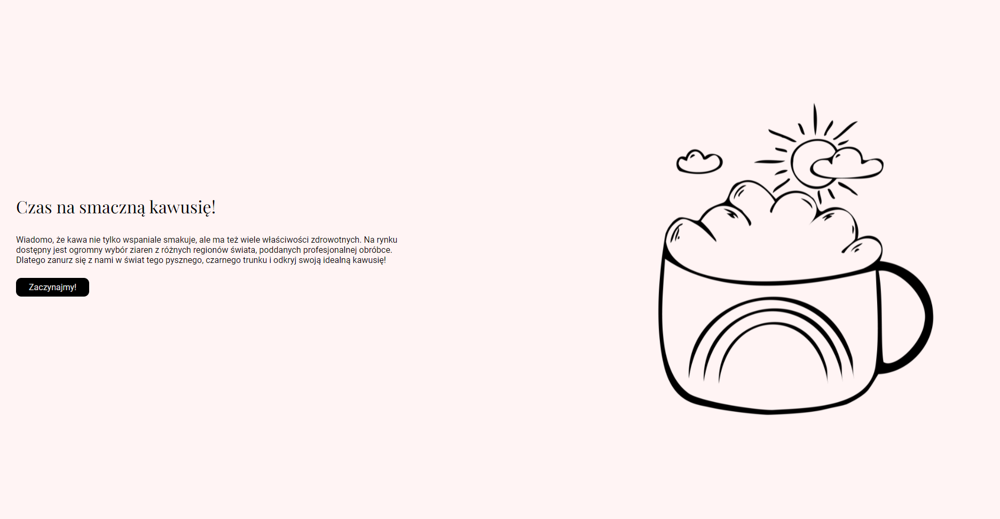
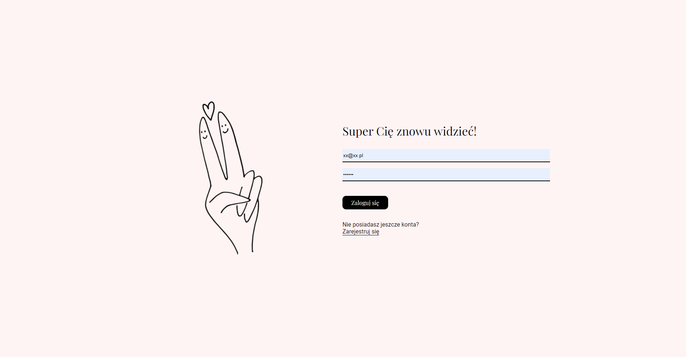
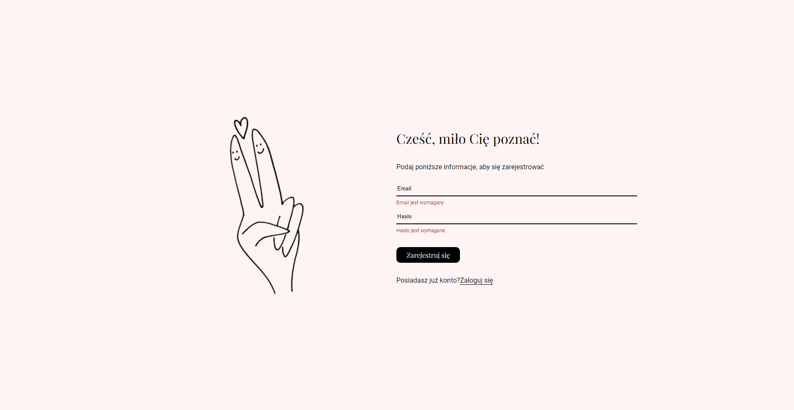
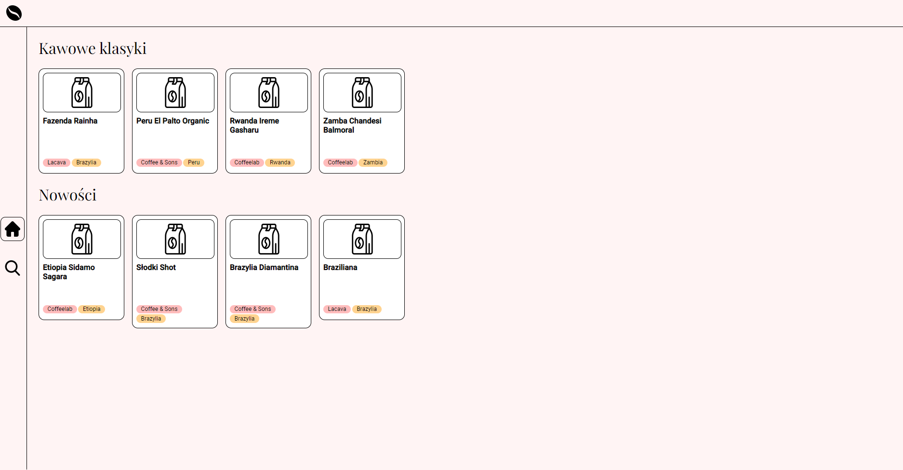
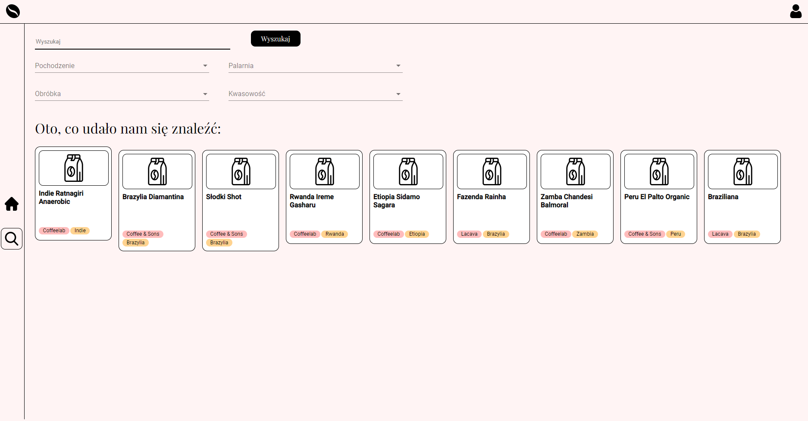
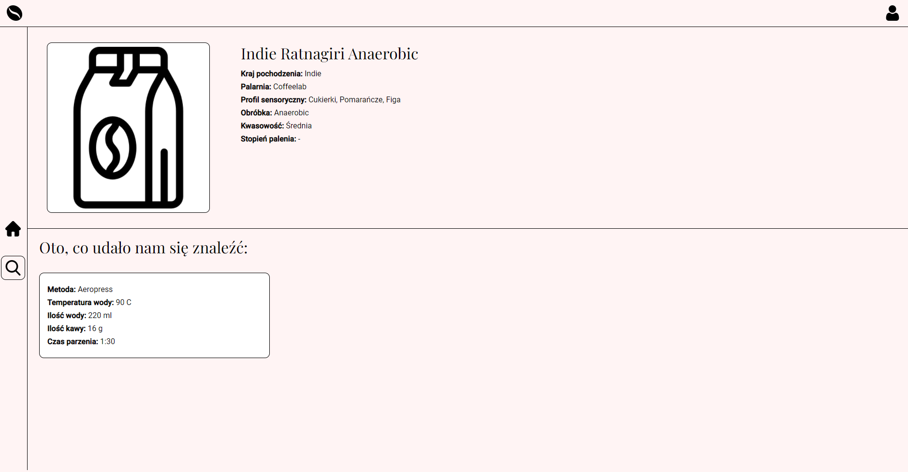
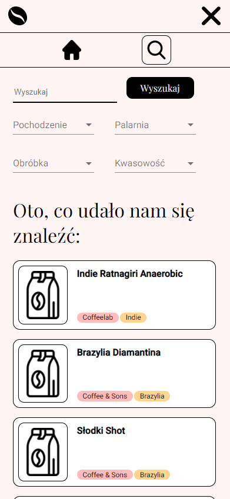
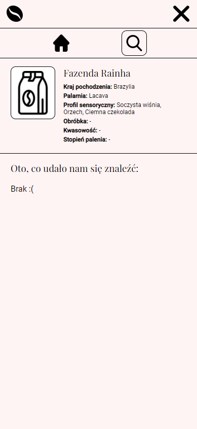

# Kawka

This project was generated with [Angular CLI](https://github.com/angular/angular-cli) version 13.0.2.

This project is for purpose of a class "Techniki Programowania Frontendowego".

The application is for purpose of a class "Techniki Programowania Frontendowego" and was created for all coffee fans, who struggle in preparing coffee and finding hidden flavors. Sound interesting? Check [our website](https://kawka-d542f.web.app/start)! ☕

## Website
### Desktop version:

User can log in or register:

Website contains home and search page:

After clicking on coffee card user is redirected to custom coffee page, which displays more informations about particular item:

### Mobile version is also available.
Examples: 

 

## Technology stack
- HTML5
- CSS, SCSS
- Angular, Angular Material
- Firebase, Firestore

## Development server

Run `ng serve` for a dev server. Navigate to `http://localhost:4200/`. The app will automatically reload if you change any of the source files.

## Code scaffolding

Run `ng generate component component-name` to generate a new component. You can also use `ng generate directive|pipe|service|class|guard|interface|enum|module`.

## Build

Run `ng build` to build the project. The build artifacts will be stored in the `dist/` directory.

## Further help

To get more help on the Angular CLI use `ng help` or go check out the [Angular CLI Overview and Command Reference](https://angular.io/cli) page.
